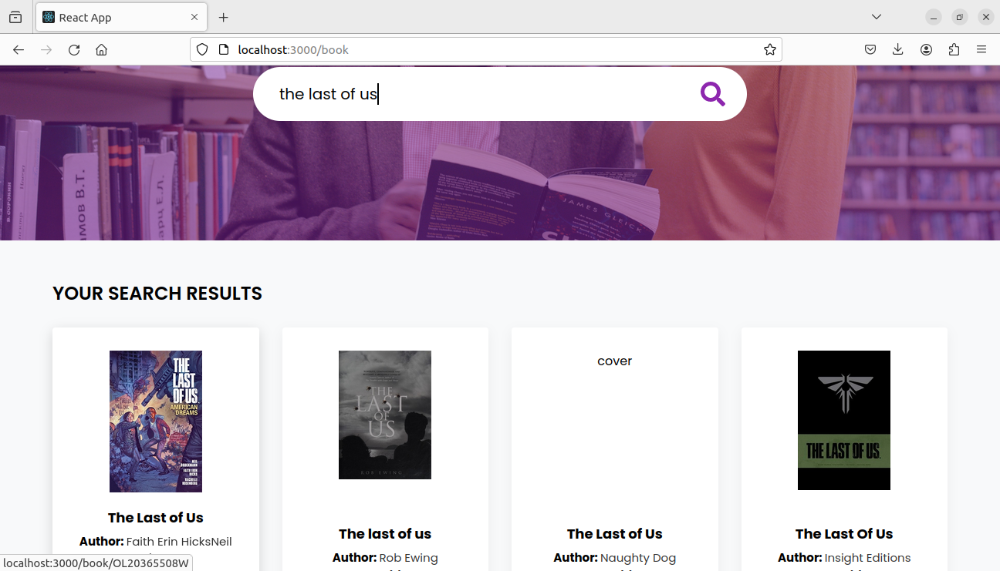
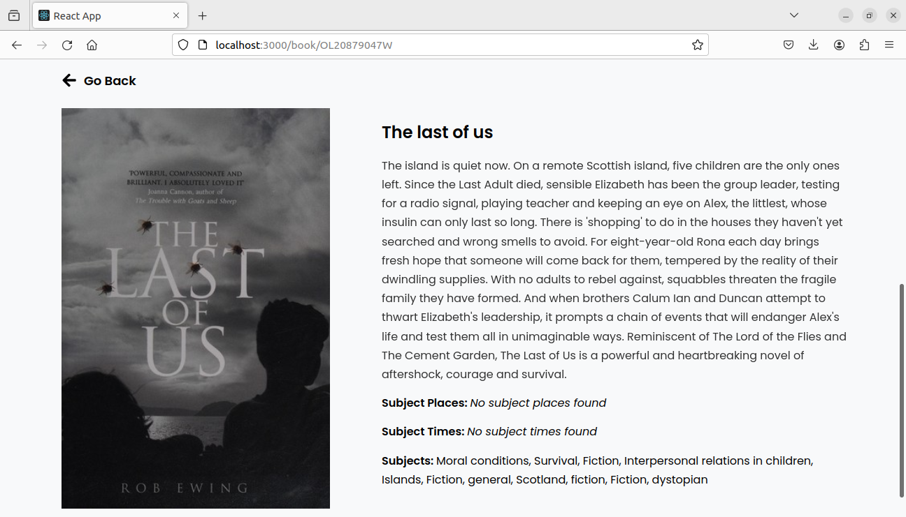

# BookHub: Frontend for Open Library Search API

This app allows users to search for books in Open Library of archive.org. We use FetchAPI to make search queries through Open Library Search API. The list of books is displayed as tiles. Clicking on the title of any book gives more details about that particular book

## Steps to setup
Clone the Repository:

``` git clone https://github.com/00AR/bookhub.git ```

To install the dependencies, open bookhub directory in the terminal and run the command:

``` npm install ```

To run the app

``` npm start ```
## Screenshots
- Home Page

- Search Results Page

- Book Details Page
